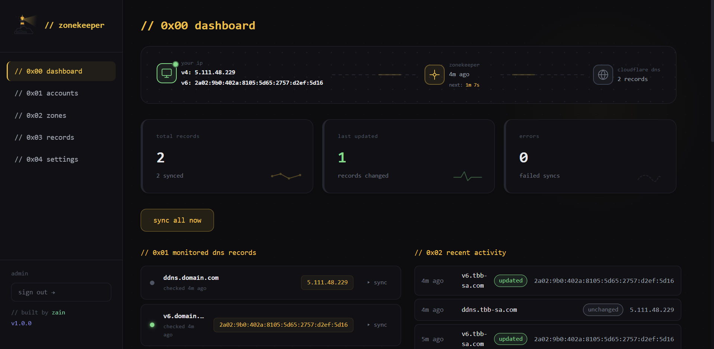
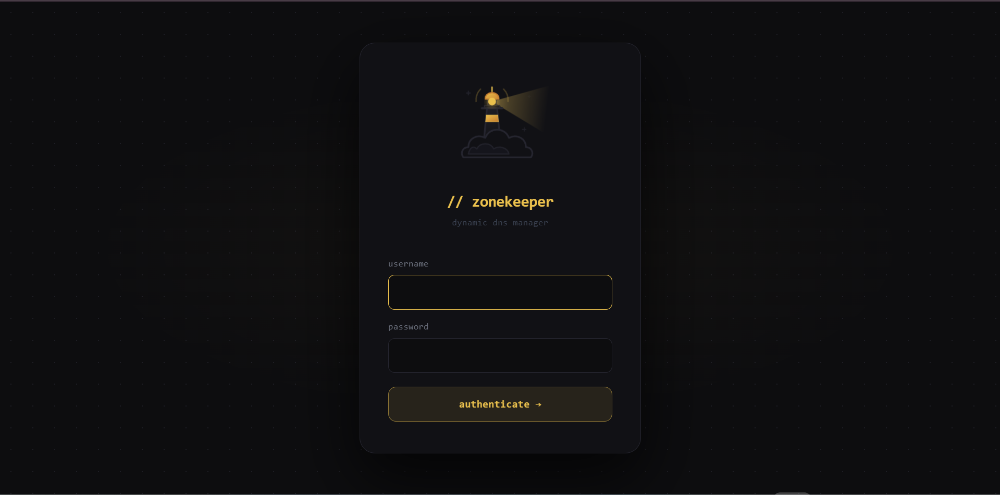

<p align="center">
  
</p>

<h1 align="center">Zonekeeper — Cloudflare DDNS Manager</h1>

<p align="center">
  
  
  
  
</p>

<p align="center">
  A self-hosted web application that replaces multiple custom DDNS bash scripts with a single, secure, and unified service. Manage and monitor all of your Cloudflare DNS zones from a single dashboard, with an automated scheduler keeping them in sync with your public IP.
</p>

---

## Screenshots

<p align="center">
  
  <br/><br/>
  
</p>

---

## Features

- **Multi-Account Support**: Manage multiple Cloudflare accounts using either Global API Keys or scoped API Tokens.
- **Dynamic Zone Tracking**: Add any number of DNS zones and A/AAAA records to keep updated.
- **Automated Synchronization**: Periodic IP monitoring and synchronization (configurable poll interval, minimum 60 seconds).
- **Granular Control**: Force-sync individual records or sync all records at once directly from the interactive dashboard.
- **Interactive Dashboard**: Features a live public IP flow visualizer with animated packets, sync statistics with sparkline charts, and a detailed recent activity logs feed.
- **High Security**:
  - **AES-256-GCM encryption** for storing Cloudflare API keys at rest.
- **Lightweight Infrastructure**: Single SQLite database file — no external database server needed.

---

## Important DNS Setup Notes

> [!IMPORTANT]
> **Records Must Exist in Cloudflare First**: Zonekeeper updates existing records; it does not automatically create them in your Cloudflare DNS zone. Before adding a record to Zonekeeper, make sure it already exists in your Cloudflare dashboard.
>
> You can configure the record in Cloudflare with any dummy/placeholder IP address:
> - **For `A` (IPv4) records**: Use a placeholder IP such as `192.0.2.1`
> - **For `AAAA` (IPv6) records**: Use a placeholder IPv6 such as `2001:db8::1`

---

## Quick Start (Docker Compose)

The easiest way to run Zonekeeper is with Docker Compose. The pre-built image is published to GitHub Container Registry — **no need to clone the repository**.

### Option A — Pull from registry (recommended)

1. **Create a `docker-compose.yml`** with the following content:
   ```yaml
   services:
     zonekeeper:
       image: ghcr.io/almufty/zonekeeper:latest
       container_name: zonekeeper
       restart: unless-stopped
       ports:
         - "3000:3000"
       volumes:
         - zonekeeper_data:/app/data
       environment:
         - NODE_ENV=production
         - SESSION_SECRET=your_long_session_secret_here
         - ENCRYPTION_KEY=your_64_char_hex_encryption_key_here

   volumes:
     zonekeeper_data:
   ```

2. **Generate secrets**:
   ```bash
   # Run twice — once for SESSION_SECRET, once for ENCRYPTION_KEY
   node -e "console.log(require('crypto').randomBytes(32).toString('hex'))"
   ```

3. **Start the container**:
   ```bash
   docker compose up -d
   ```

### Option B — Build from source

Clone the repository first, then use the included `docker-compose.yml` which has the local build pre-configured:

```bash
git clone https://github.com/almufty/zonekeeper.git
cd zonekeeper-ddns
# Edit docker-compose.yml to set your SESSION_SECRET and ENCRYPTION_KEY, then:
docker compose up -d
```

---

Open `http://localhost:3000` to access the interface. On the first run, the admin password will be printed to the container logs:

```bash
docker logs zonekeeper
```

---

## Native Installation (Node.js)

### Requirements
- **Node.js ≥ 22**
- npm

### Setup Steps
1. **Clone the repository**:
   ```bash
   git clone https://github.com/almufty/zonekeeper.git
   cd zonekeeper-ddns
   ```

2. **Install all dependencies** (backend + frontend):
   ```bash
   npm run install:all
   ```

3. **Configure environment secrets**:
   ```bash
   cp .env.example .env
   # Open .env and populate SESSION_SECRET and ENCRYPTION_KEY (strongly recommended)
   ```

4. **Build the frontend**:
   ```bash
   npm run build
   ```

5. **Start the server**:
   ```bash
   npm start
   ```
   Open `http://localhost:3000` to start using the app.

---

## Environment Variables

Configure Zonekeeper using the following variables in a `.env` file or within your container environment:

| Variable | Default | Description |
| :--- | :--- | :--- |
| `PORT` | `3000` | Port the server listens on. |
| `DB_PATH` | `./zonekeeper.db` | Location of the SQLite database. |
| `POLL_INTERVAL` | `300` | Initial default sync interval in **seconds** (minimum 60). Can be changed dynamically in Web UI settings. |
| `LOG_RETENTION_DAYS` | `30` | Initial default logs retention period in **days**. Can be changed dynamically in Web UI settings. |
| `SESSION_SECRET` | *(Auto-generated)* | Secret string for signing cookies (required in production). |
| `ENCRYPTION_KEY` | *(Plaintext)* | 64-char hex key used to encrypt Cloudflare API keys at rest. |
| `ADMIN_USER` | `admin` | Initial admin account username. |
| `ADMIN_PASS` | *(Auto-generated)* | Initial admin account password (printed to stdout on first startup). |

---

## Development & Test

Run the backend and frontend separately with watch compilation:

```bash
# Terminal 1: run backend API
npm run dev:backend

# Terminal 2: run Vite dev server (proxies API requests to port 3000)
npm run dev:frontend
```

Run test suite:
```bash
npm test
```

---

## License

This project is licensed under the GNU General Public License v3.0 (GPL-3.0). See [LICENSE](file:///C:/Projects/zonekeeper-ddns/LICENSE) for details.
